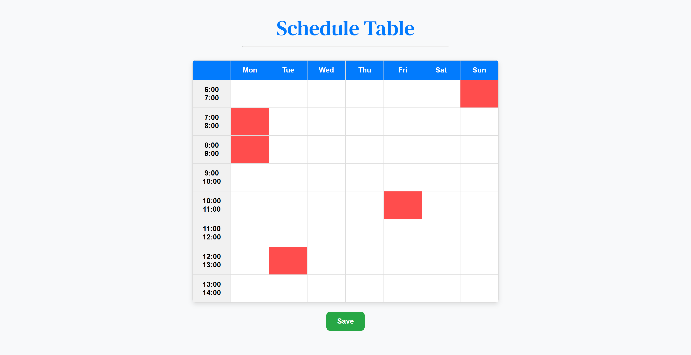

# ScheduleTable

**ScheduleTable** is a simple tool that allows you to create a schedule with days and corresponding hours. It provides an easy way to select and store time slots.



## Usage

### Step 1: Create a Container
Create a `div` with the `id` `schedule-container` in your HTML:

```html
<div id="schedule-container"></div>
```

### Step 2: Initialize the ScheduleTable
Initialize the `ScheduleTable` class with the days you want to display, and the start and end hours:
```javascript
const days = ["Mon", "Tue", "Wed", "Thu", "Fri", "Sat", "Sun"];
const startHour = 6;
const endHour = 13;

const schedule = new ScheduleTable(days, startHour, endHour);
```

### Step 3: Get Selected Time Slots
You can get the selected time slots using the getSelectedSlots() function. For example:

```javascript
document.getElementById("save-button").addEventListener("click", () => {
    const slots = schedule.getSelectedSlots();

    fetch("./save_slots.php", {
        method: "POST",
        headers: { "Content-Type": "application/json" },
        body: JSON.stringify({ slots })
    })
    .then(response => response.text())
    .then(data => console.log("Slots saved:", data))
    .catch(error => console.error("Error saving slots:", error));
});
```
